# MANUAL API DINÁMICA

En este documento se explicará los diferentes usos del API dinámica

La API dinámica consta de tres partes:
 - Inicio
 - Consultas SQL
 - Definiciones de Swagger 
 
## Inicio
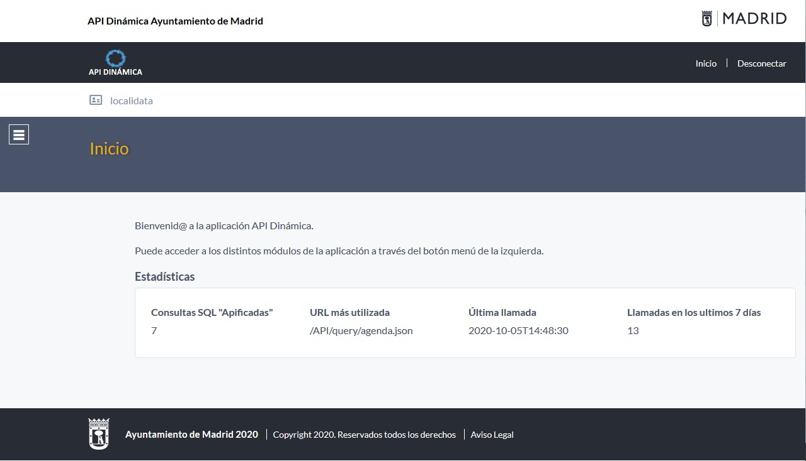

En la cabecera se tienen los enlaces:
 - Inicio, este enlace irá a la pantalla de inicio
 - Desconectar, este enlace desconectará la sesión.

En el menú se tienen los siguientes enlaces:
 - Consultas SQL, este enlace irá al listado de las consultas SQL
 - Definiciones de Swagger, este enlace irá al listado de definiciones Swagger
 
En la pantalla de inicio aparecerán estadísticas de utilidad:

 - Consultas SQL "Apificadas", número de consultas apificadas.
 - URL más utilizada, URL de la consulta SQL más utilidada.
 - Última llamada, fecha y hora de la última llamada.
 - Llamadas en los últimos 7 días, número de llamadas en los últimos 7 días.
 
## Consultas SQL
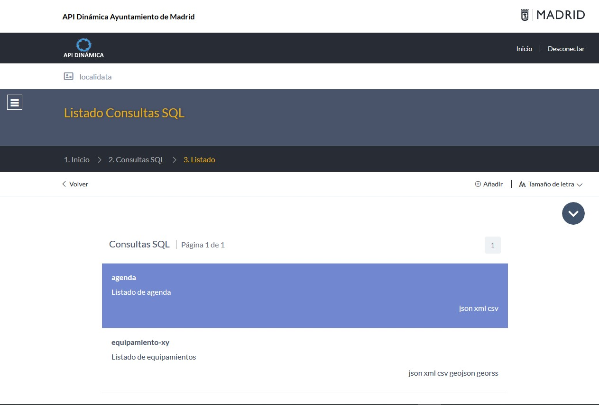

### Acceso a la ficha de una consulta SQL
En el listado de consultas SQL se hará clic en la de las consultas, para acceder a la ficha de la consulta.

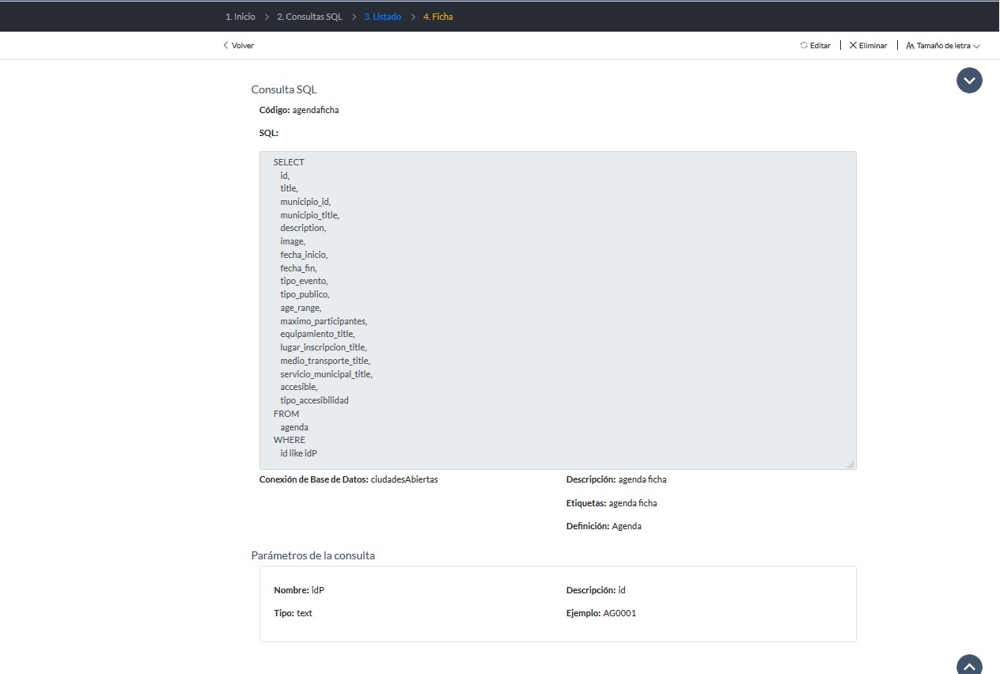

### Acceso a la llamada en json, xml, csv
En el listado de consultas SQL se hará clic en las palabras json, xml, csv para acceder a la llamada de json, xml, csv.

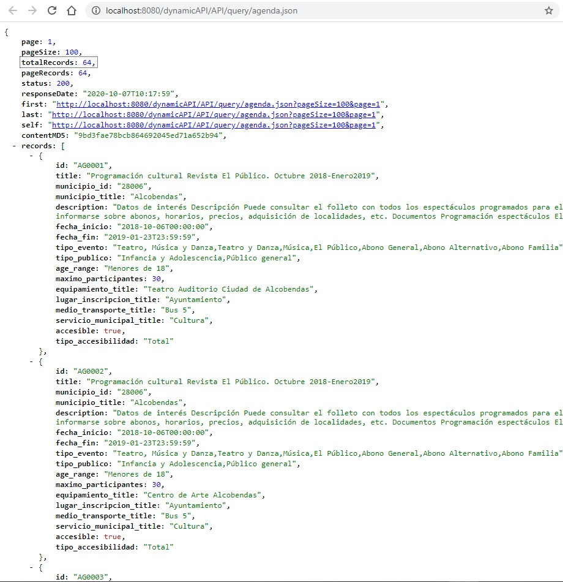

### Añadir consulta SQL
En el listado de consultas SQL se hará clic en el botón "Añadir"

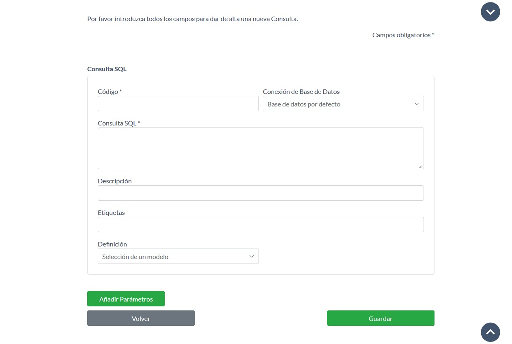
 
En este formulario se deberá de rellenar los siguientes campos:

 - Código, en este campo se rellenará el nombre que tendrá la llamada en la URL
 - Conexión de Base de Datos, en este campo se elegirá la base de datos donde se ejecutará la query de la consulta.
 - Consulta SQL, en este campo se rellenará la query que se ejecutará en la base de datos.
 - Descripción,  en este campo se rellenará la descripción de la consulta SQL.
 - Etiquetas, en este campo se rellenará la etiqueta que se incluirá en la definición de Swagger.
 - Definición, en este campo se elegirá el modelo de la definición de Swagger. Si se deja en blanco se creará una nueva.

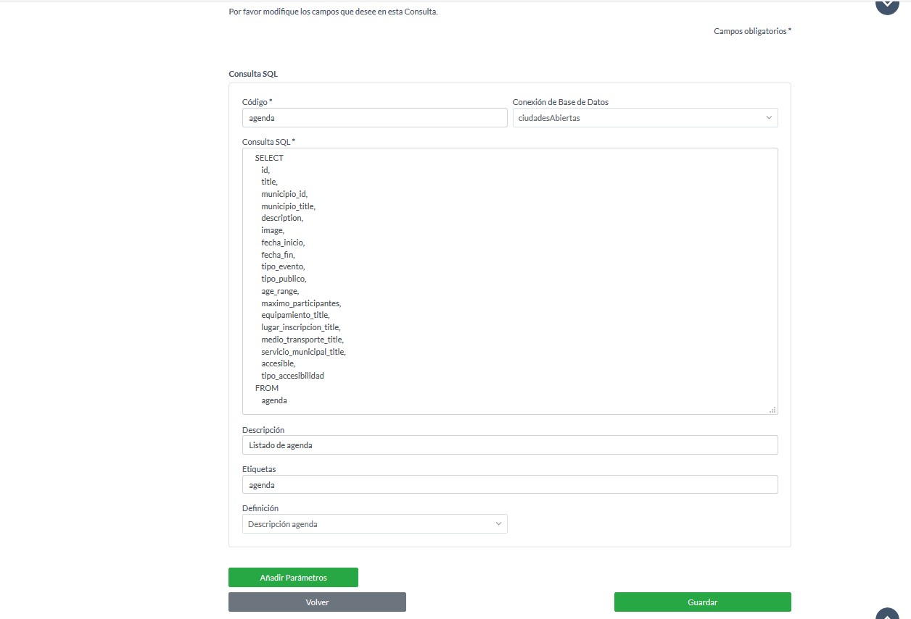

#### Añadir un parámetro a una consulta SQL
Un parámetro sirve para poder introducir que el usuario pueda introducir texto en una consulta SQL. Por ejemplo puede usarse para filtrar o para seleccionar un determinado campo.

En la creación o edición de una consulta SQL se pulsará el botón "Añadir parámetros"

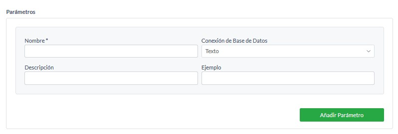

En este formulario se deberá de rellenar los siguientes campos:

 - Nombre, en este campo se rellenará el nombre con el que usaremos el parámetro en el campo Consulta SQL
 - Conexión de base de datos, en este campo se elegirá que tipo de parámetro es texto, numérico o fecha.
 - Descripción, en este campo se rellenará la descripción del parámetro.
 - Ejemplo, en este campo se rellenará un ejemplo de como rellenar el parámetro. 

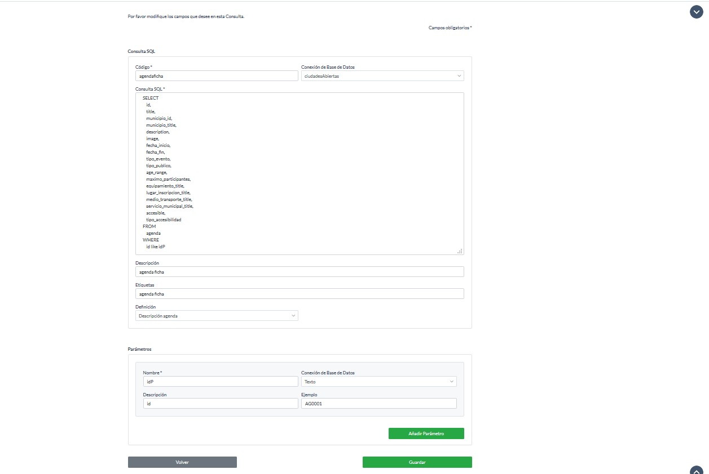

En la imagen se puede ver como se ha creado un parámetro de nombre idP de tipo texto. Para usar dicho parámetro se ha añadido en la consulta SQL.

#### Añadir formato GeoJSON o GeoRSS
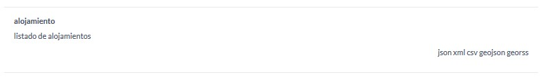

Para que los formatos GeoJSON o GeoRSS aparezcan en el listado de consultas SQL, en el campo consulta SQL deben de aparecer las siguientes etiquetas:

 - xETRS89
 - yETRS89
 
Para coordenadas X e Y

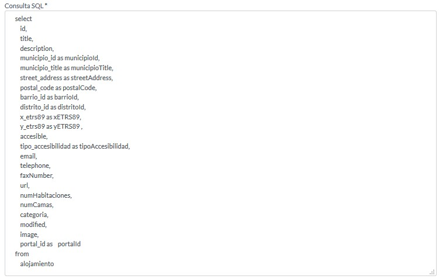

 - latitud
 - longitud

Para coordenadas latitud y longitud

 - hasGeometry
 
Para geometrías.

### Editar consulta SQL
En el listado de consultas SQL se hará clic en la de las consultas, para acceder a la ficha de la consulta.

Una vez se está en la ficha de la consulta se hará clic en el botón editar

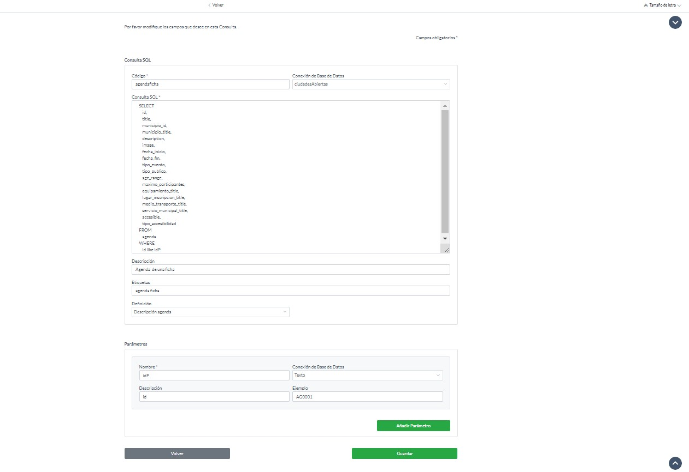

### Eliminar consulta SQL 

En el listado de consultas SQL se hará clic en la de las consultas, para acceder a la ficha de la consulta.

Una vez se está en la ficha de la consulta se hará clic en el botón 'Eliminar'

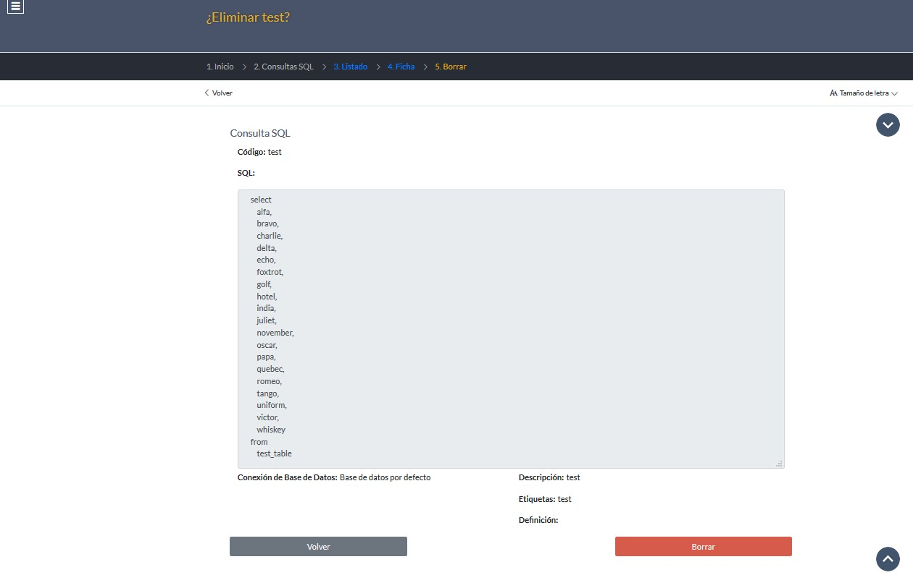

Se hará clic en el botón borrar, aparecerá en pantalla 'elemento borrado'

### Cambiar el tamaño de letra

Se hará clic en el enlace 'Tamaño de letra' y se pulsará 'Aumentar' para aumentar el tamaño de letra o 'reducir' para reducir el tamaño de letra

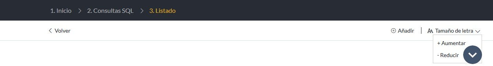

## Definiciones de Swagger 
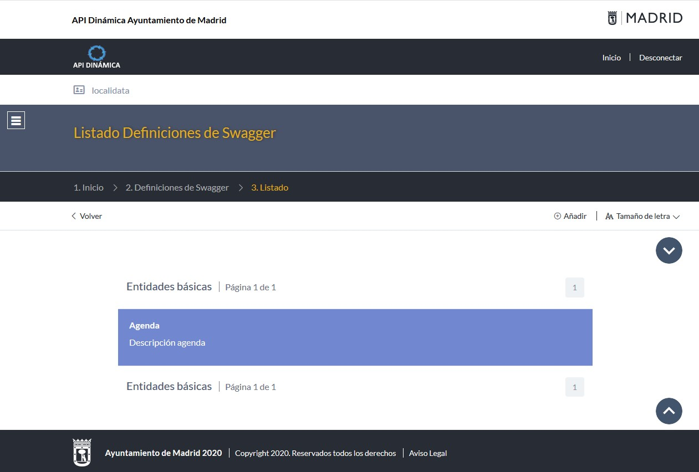

### Añadir definición de Swagger 
En el listado de definiciones Swagger se hará clic en el enlace 'Añadir'

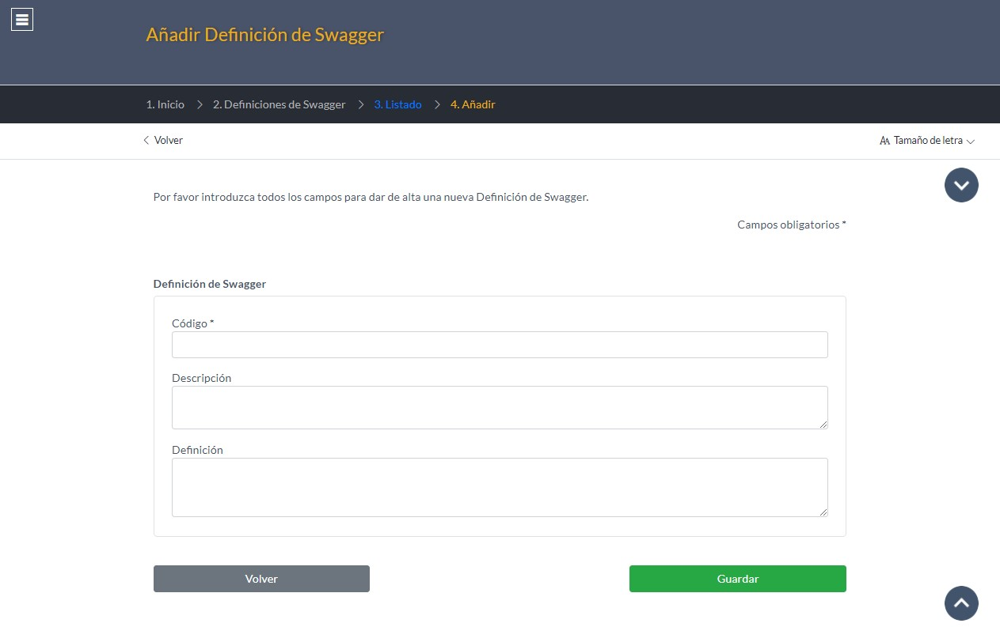

En este formulario se deberá de rellenar los siguientes campos:

 - Código, en este campo se rellenará el código de la definición Swagger.
 - Descripción, en este campo se rellenará la descripción de la definición Swagger.
 - Definición, en este campo se rellenará la definición Swagger en formato JSON.
 
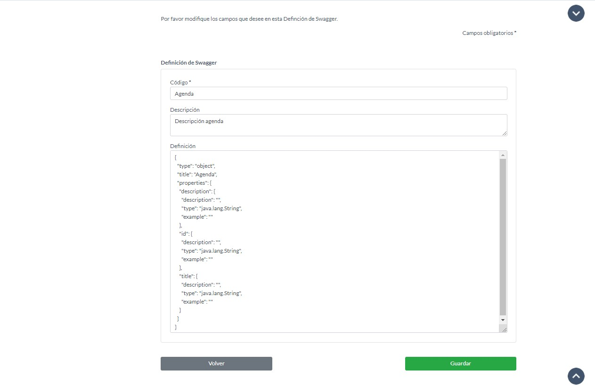
 
### Acceso a la ficha de definición de Swagger 
En el listado de definiciones de Swagger se hará clic en la definición de Swagger, para acceder a la ficha de la definición de Swagger.

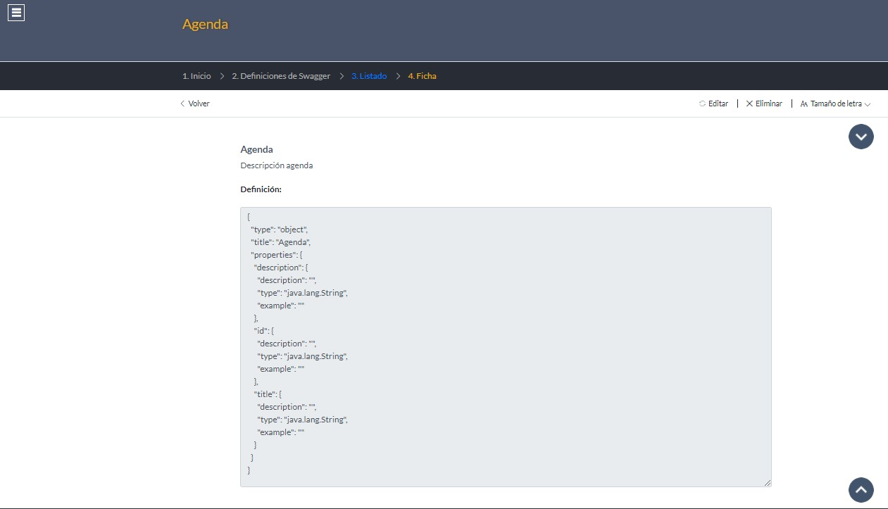
 
### Editar definición

En la ficha de una definición de Swagger se hará clic al enlace 'Editar'

### Eliminar definición

En la ficha de una definición de Swagger se hará clic al enlace 'Eliminar'

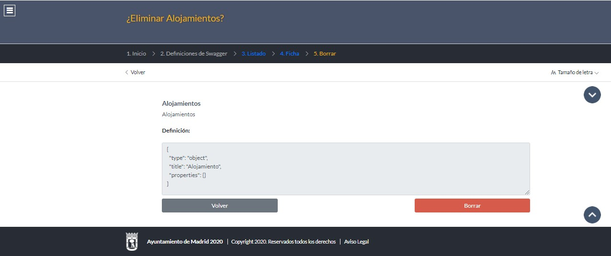

Se hará clic en el botón borrar, aparecerá en pantalla 'elemento borrado'