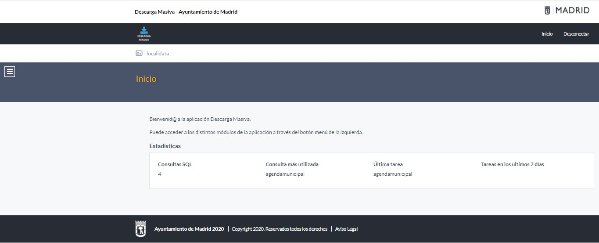
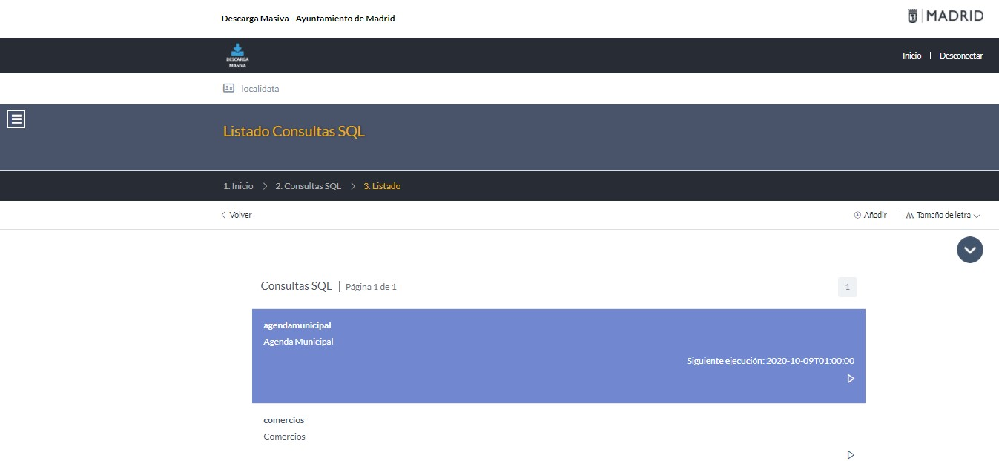
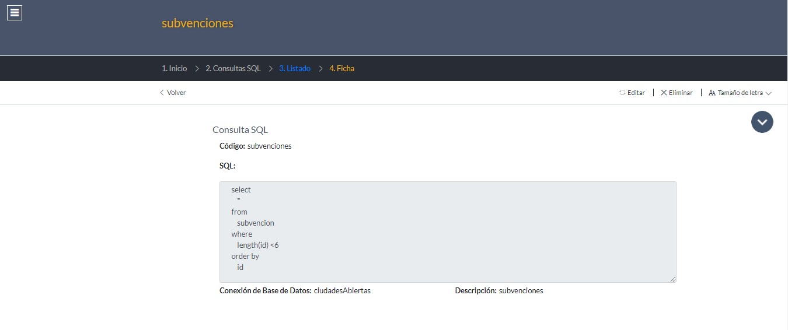
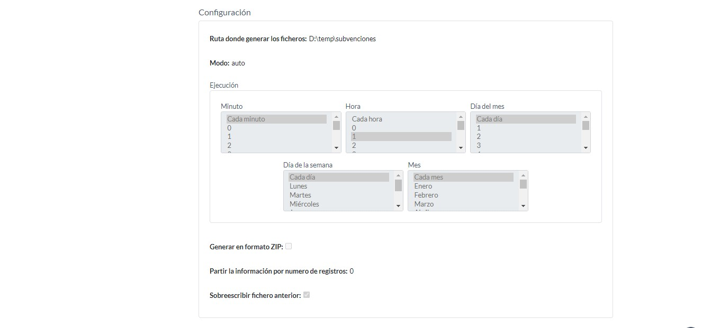
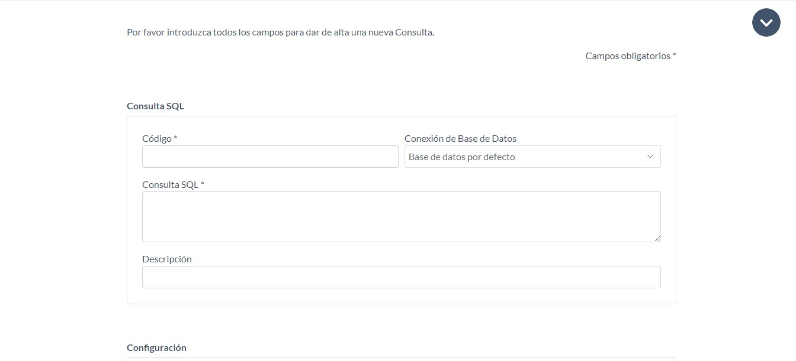
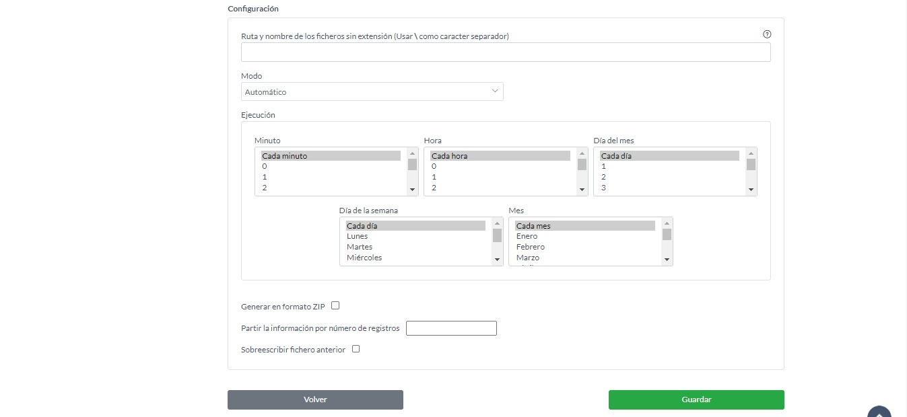
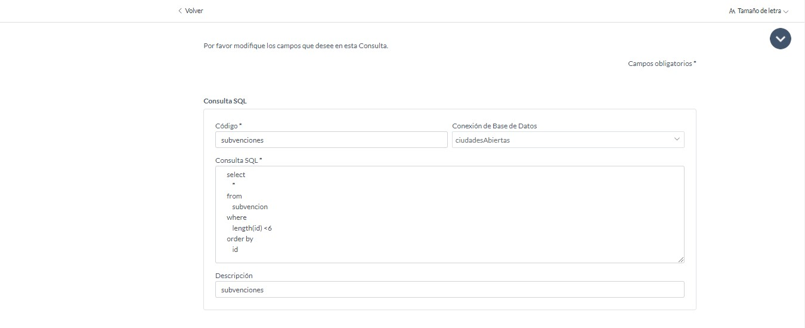
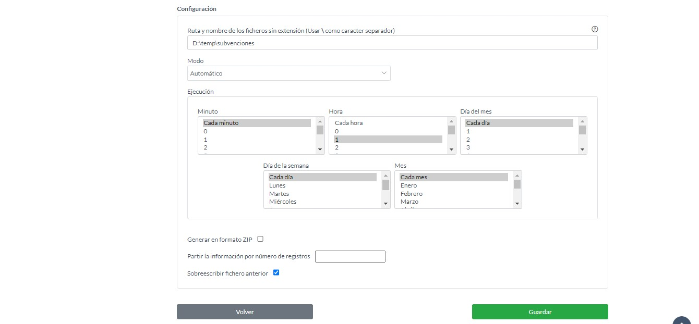
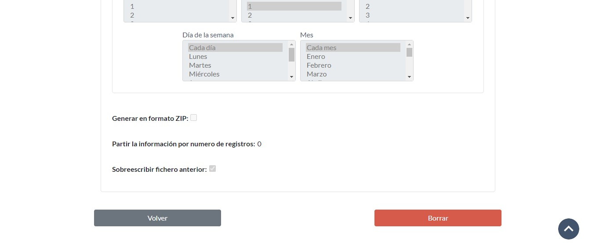
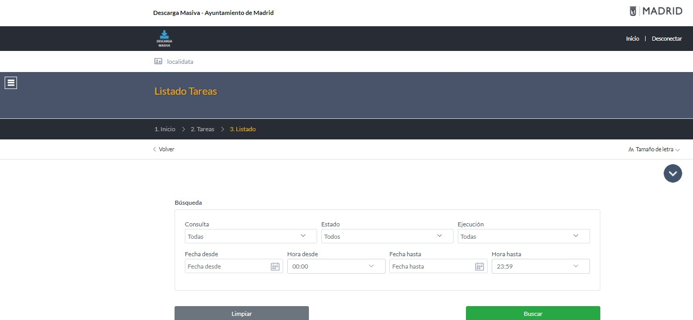

# MANUAL DESCARGA MASIVA

En este documento se explicará los diferentes usos de la descarga masiva

La descarga masiva consta de tres partes:
 - Inicio
 - Consultas SQL
 - Listado Tareas
 
## Inicio

En la cabecera se tienen los enlaces:
 - Inicio, este enlace irá a la pantalla de inicio
 - Desconectar, este enlace desconectará la sesión.

En el menú se tienen los siguientes enlaces:
 - Consultas SQL, este enlace irá al listado de las consultas SQL
 - Listado Tareas, 
 
En la pantalla de inicio aparecerán estadísticas de utilidad:

 - Consultas SQL, número de consultas SQL configuradas. 
 - Consulta más utilizada, consulta más utilizada.
 - Última tarea, última tarea ejecutada.
 - Tareas en los últimos 7 días, número tareas en los últimos 7 días.
 
## Consultas SQL

### Acceso a la ficha de una consulta SQL
En el listado de consultas SQL se hará clic en la de las consultas, para acceder a la ficha de la consulta.

### Ejecución manual de una tarea 
En el listado de consultas SQL se hará clic en el triangulo.

### Añadir consulta SQL
En el listado de consultas SQL se hará clic en el botón "Añadir"

 
En este formulario se deberá de rellenar los siguientes campos:

 - Código, en este campo se rellenará el nombre que tendrá la tarea
 - Conexión de Base de Datos, en este campo se elegirá la base de datos donde se ejecutará la tarea.
 - Consulta SQL, en este campo se rellenará la query que se ejecutará en la base de datos.
 - Descripción, en este campo se rellenará la descripción de la tarea.
 - Ruta y nombre de los ficheros sin extensión, en este campo se rellenará la ruta y el nombre de los ficheros que se generarán de la tarea.
 - Modo, en este campo se elegirá el modo de ejecución de la tarea.
 - Elección Minuto, en este campo se elegirá el minuto de ejecución de la tarea.
 - Elección Hora, en este campo se elegirá la hora de ejecución de la tarea.
 - Elección Día del mes, en este campo se elegirá el día del mes de ejecución de la tarea.
 - Elección Día de la semana, en este campo se elegirá el día de la semana de ejecución de la tarea.
 - Elección Mes, en este campo se elegirá el mes de ejecución de la tarea.
 - Generar en formato ZIP, en este campo se seleccionará si se quiere que los ficheros.
 - Partir la información por numero de registros, en este campo se rellenará el número de registros por que tendrá cada fichero.
 - Sobreescribir fichero anterior, en este campo se seleccionará si se desea sobreescribir el anterior fichero creado.

### Editar consulta SQL
En el listado de consultas SQL se hará clic en la de las consultas, para acceder a la ficha de la consulta.

Una vez se está en la ficha de la consulta se hará clic en el botón editar

### Eliminar consulta SQL 

En el listado de consultas SQL se hará clic en la de las consultas, para acceder a la ficha de la consulta.

Una vez se está en la ficha de la consulta se hará clic en el botón 'Eliminar'

Se hará clic en el botón borrar, aparecerá en pantalla 'elemento borrado'

### Cambiar el tamaño de letra

Se hará clic en el enlace 'Tamaño de letra' y se pulsará 'Aumentar' para aumentar el tamaño de letra o 'reducir' para reducir el tamaño de letra

## Listado Tareas 

### Búsqueda de una tareas
Se rellenará el formaulario de búsqueda de las tareas según el criterio deseado. Y se pulsará el botón buscar.
