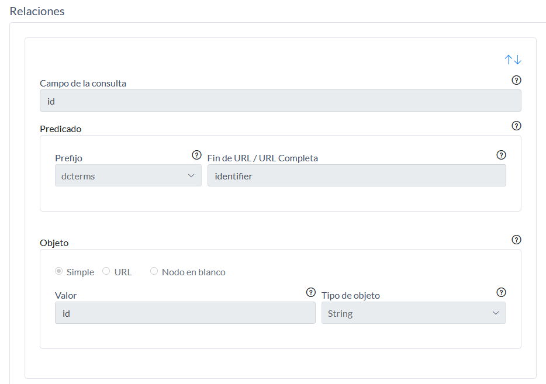

# MANUAL API DINÁMICA

En este documento se explicará los diferentes usos del API dinámica

La API dinámica consta de las siguientes módulos:

 - Inicio
 - Consultas SQL
 - Definiciones de Swagger 
 - Datos Semánticos
 - Documentación
 
## Inicio


En la cabecera se tienen los enlaces:

 - Inicio, este enlace irá a la pantalla de inicio
 - Desconectar, este enlace desconectará la sesión.

En el menú se tienen los siguientes enlaces:

 - Consultas SQL
 - Definiciones de SWAGGER
 - Datos Semánticos
 - Documentación
 
En la pantalla de inicio aparecerán estadísticas de utilidad:

 - Consultas SQL "Apificadas", número de consultas apificadas.
 - URL más utilizada, URL de la consulta SQL más utilidada.
 - Última llamada, fecha y hora de la última llamada.
 - Llamadas en los últimos 7 días, número de llamadas en los últimos 7 días.
 
## Consultas SQL


### Acceso a la ficha de una consulta SQL
En el listado de consultas SQL se hará clic en la de las consultas, para acceder a la ficha de la consulta.


### Acceso a la llamada en json, xml, csv
En el listado de consultas SQL se hará clic en las extensiones json, xml, o csv para acceder a la llamada en el formato seleccionado.


### Añadir consulta SQL
En el listado de consultas SQL se hará clic en el menú "Añadir" y se seleccionará "Consulta Básica":


 
En este formulario se deberá de rellenar los siguientes campos:

 - Código, en este campo se rellenará el nombre que tendrá la llamada en la URL
 - Conexión de Base de Datos, en este campo se elegirá la base de datos donde se ejecutará la query de la consulta.
 - Consulta SQL, en este campo se rellenará la query que se ejecutará en la base de datos.
 - Descripción,  en este campo se rellenará la descripción de la consulta SQL.
 - Etiquetas, en este campo se rellenará la etiqueta que se incluirá en la definición de Swagger.
 - Definición, en este campo se elegirá el modelo de la definición de Swagger. Si se deja en blanco se creará una definición nueva, con la información básica.


#### Añadir un parámetro a una consulta SQL
Un parámetro sirve para poder introducir que el usuario pueda introducir texto en una consulta SQL. Por ejemplo puede usarse para filtrar o para seleccionar un determinado campo.

En la creación o edición de una consulta SQL se pulsará el botón "Añadir parámetros"


En este formulario se deberá de rellenar los siguientes campos:

 - Nombre, en este campo se rellenará el nombre con el que usaremos el parámetro en el campo Consulta SQL
 - Conexión de base de datos, en este campo se elegirá que tipo de parámetro es texto, numérico o fecha.
 - Descripción, en este campo se rellenará la descripción del parámetro.
 - Ejemplo, en este campo se rellenará un ejemplo de como rellenar el parámetro. 


En la imagen se puede ver como se ha creado un parámetro de nombre idP de tipo texto. Para usar dicho parámetro se ha añadido en la consulta SQL.

#### Añadir formatos GeoJSON y GeoRSS


Para que los formatos GeoJSON o GeoRSS aparezcan en el listado de consultas SQL, en el campo consulta SQL deben de aparecer las siguientes campos:

 - xETRS89 e ETRS89 para representar puntos (X,Y) en formato ETRS89. El srId de origen se configura en el archivo de configuración.
 - hasGeometry para representar polígonos
  
Para añadir una consulta que soporte puntos, en la consulta deben existir los atributos "xETRS89" e "yETRS89". Ejemplo:

```
	SELECT
        id ,
        title ,      
        x_etrs89 AS xETRS89 ,
        y_etrs89 AS yETRS89 
    FROM
        equipamiento 
```

Para añadir una consulta que soporte poligonos, en la consulta deben existir el atributo "hasGeometry". Ejemplo:


``` 
    SELECT
        id,
        identifier,
        title,
        geometry as hasGeometry 
    FROM
        territorio_pais
```
 
#### Añadir consultas específicas

En el menú "añadir" aparecen las siguientes opciones:

 - Consulta Básica: es la opción que se ha explicado en la sección "Añadir consulta SQL".
 - Consulta Agrupada: esta opción precarga un sentencia SQL de ejemplo y los parámetros necesarios para escribir una consulta que realiza operaciones de agrupación (SUM, AVG, COUNT,...).
 - Consulta Distinct: esta opción precarga un sentencia SQL de ejemplo y los parámetros necesarios para escribir una consulta que contiene la restricción "distinct".
 - Consulta con coordenadas: esta opción precarga un sentencia SQL de ejemplo y los parámetros necesarios para escribir una consulta que contiene campos X y Y.
 - Consulta con distancia geográfica: esta opción precarga un sentencia SQL de ejemplo y los parámetros necesarios para escribir una consulta que permite realizar busquedas por distancica a partir de un punto (X e Y) y una distancia en metros.

### Editar consulta SQL
En el listado de consultas SQL se hará clic en la de las consultas, para acceder a la ficha de la consulta.

Una vez se está en la ficha de la consulta se hará clic en el botón editar


### Eliminar consulta SQL 

En el listado de consultas SQL se hará clic en una de ellas, para acceder a su ficha.

Una vez se está en la ficha de la consulta se hará clic en el botón 'Eliminar'


Se hará clic en el botón borrar, aparecerá en pantalla 'elemento borrado'

### Cambiar el tamaño de letra

Se hará clic en el enlace 'Tamaño de letra' y se pulsará 'Aumentar' para aumentar el tamaño de letra o 'reducir' para reducir el tamaño de letra


## Definiciones de Swagger 


### Añadir definición de Swagger 
En el listado de definiciones Swagger se hará clic en el enlace 'Añadir'


En este formulario se deberá de rellenar los siguientes campos:

 - Código, en este campo se rellenará el código de la definición Swagger.
 - Descripción, en este campo se rellenará la descripción de la definición Swagger.
 - Definición, en este campo se rellenará la definición Swagger en formato JSON.
 

 
### Acceso a la ficha de definición de Swagger 
En el listado de definiciones de Swagger se hará clic en la definición de Swagger, para acceder a la ficha de la definición de Swagger.


 
### Editar definición

En la ficha de una definición de Swagger se hará clic al enlace 'Editar'


### Eliminar definición

En la ficha de una definición de Swagger se hará clic al enlace 'Eliminar'


Se hará clic en el botón borrar, aparecerá en pantalla 'elemento borrado'

### Acceso a Swagger
La url de acceso a los servicios de swagger esta disponible en la siguiente url:  http://servidor/contextoApp/swagger/index.html

Como ejemplo asociamos la url del servicio de pruebas establecido en Alzir: https://alzir.dia.fi.upm.es/dynamicAPI/swagger/index.html


## Datos Semánticos

En este módulo se configuran las consultas SQL que previamente están dadas de alta, para asignarles información semantica, y así poder dotar a las llamadas de esa consulta de los siguientes formatos:

 - rdf
 - ttl
 - jsonld
 - n3
 
 Este módulo esta compuesto por dos submodulos:
 
 - Prefijos
 - Definiciones

### Prefijos

En este submodulo se pueden gestionar los prefijos que se utilizan en el componente de definiciones semánticas.

Un prefijo se compone de una URI y una abreviatura de la misma.

Ejemplos:

http://www.w3.org/1999/02/22-rdf-syntax-ns# - rdf
http://schema.org/ - schema

A continuación se describen las diferentes operaciones de este submódulo.

#### Listado de prefijos
Esta es pantalla inicial del submódulo, aquí aparecen los diferentes prefijos dados de alta.


#### Acceso a la ficha de un prefijo
En el listado de definiciones de prefijos se hará clic en cualquiera de ellos, para acceder a la ficha de la definición de Swagger.


#### Edición de un prefijo

En la ficha de un prefijo se hará clic al enlace 'Editar'


Sólo se podrán modificiar en caso de que no se estén utilizando.

#### Alta de un prefijo

En el listado de prefijos se hará clic en el enlace 'Añadir'


#### Borrado de un prefijo

En el listado de prefijos se hará clic en uno de los prefijos, para acceder a la ficha del seleccionado.

Una vez se está en la ficha se hará clic en el botón 'Eliminar'.


Se hará clic en el botón borrar, aparecerá en pantalla 'elemento borrado'

Sólo se podrán eliminar aquellos prefijos que no se estén utilizando.

### Definiciones Semánticas

Pantalla inicial del submódulo, aquí aparecen las diferentes deficiones para generar RDF sobre las consultas dadas de alta.


#### Acceso a la ficha de una definición
En el listado de definiciones se hará clic en cualquiera de ellas, para acceder a la ficha de la definición.

Las definiciones se componen de tres partes.

1) La Consulta seleccionada y los prefijos que se utilizan:


2) URI de cada elemento y URI del Tipo de cada elemento


3) Las relaciones entre cada campo de la consulta y las tripletas en las que se va a transformar en RDF.

En la siguiente imagen, se puede ver la relación de un campo 'id'.



#### Edición de una definición


